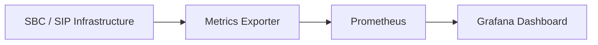

# VoIP Infrastructure Observability Dashboard

Dashboard de observabilidade para monitoramento de infraestrutura **SIP / SBC** utilizando **Prometheus** e **Grafana**.

O projeto demonstra como coletar, armazenar e visualizar métricas operacionais críticas de plataformas de comunicação em tempo real, incluindo:

* Alarmes de infraestrutura
* Sessões SIP ativas
* Registro de usuários
* Performance de CPU
* Pico de sessões
* Taxa de chamadas (CPS)

O objetivo é demonstrar práticas de **monitoramento e observabilidade aplicadas a ambientes de telecomunicações**.

---

# Arquitetura da Solução

O fluxo de dados segue o modelo clássico de observabilidade:

1. Dispositivos SBC e plataformas SIP expõem métricas
2. Um **exporter** transforma essas métricas para o formato Prometheus
3. O **Prometheus** coleta e armazena as métricas
4. O **Grafana** consulta o Prometheus e exibe dashboards

---

# Fluxograma da Arquitetura



---

# Dashboard

O dashboard apresenta métricas operacionais importantes para ambientes VoIP:

| Métrica          | Descrição                    |
| ---------------- | ---------------------------- |
| Active Alarms    | Quantidade de alarmes ativos |
| SIP Sessions     | Sessões SIP ativas           |
| CPU Usage        | Uso de CPU da plataforma     |
| Registered Users | Usuários SIP registrados     |
| Session Peak     | Pico de sessões              |
| Calls Per Second | Taxa de chamadas             |

Exemplo do dashboard:


---

# Tecnologias Utilizadas

* **Prometheus** → coleta de métricas
* **Grafana** → visualização de dados
* **PromQL** → consultas de métricas
* **Docker** → containerização do ambiente
* **Linux** → execução da stack de monitoramento

---

# Estrutura do Projeto

```
project
│
├── docker
│   └── docker-compose.yml
│
├── grafana
│   └── dashboard.json
│
├── prometheus
│   └── prometheus.yml
│
└── README.md
```

---

# Exemplos de Métricas Coletadas

```
sbc_alarm_active
sbc_sessions_active
sbc_calls_total
sbc_registered_users
sbc_register_messages_total
node_cpu_seconds_total
```

Essas métricas permitem analisar:

* estabilidade da plataforma
* carga de chamadas
* comportamento de usuários SIP
* eventos de falha

---

# Possíveis Extensões do Projeto

* Alertas com **Alertmanager**
* Integração com **Slack ou Webhooks**
* Monitoramento de **latência RTP**
* Monitoramento de **packet loss**
* Automação de provisionamento com **Terraform**

---

# Objetivo do Projeto

Demonstrar práticas de **observabilidade aplicada a infraestrutura de telecomunicações**, incluindo:

* coleta de métricas
* análise operacional
* dashboards de monitoramento
* troubleshooting de serviços SIP

---

# Autor

Eric Dias
Network & Infrastructure Engineer
Foco em **observabilidade, redes e automação de infraestrutura**
